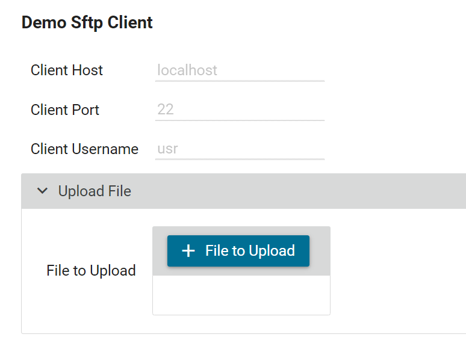
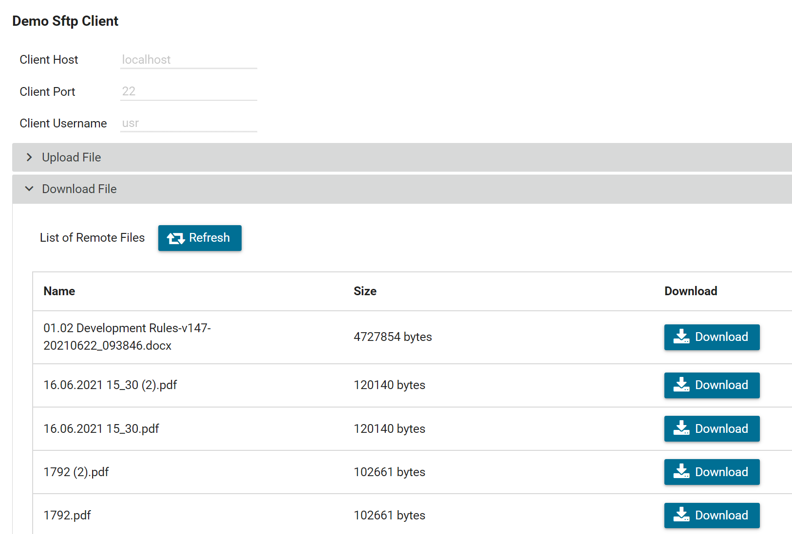
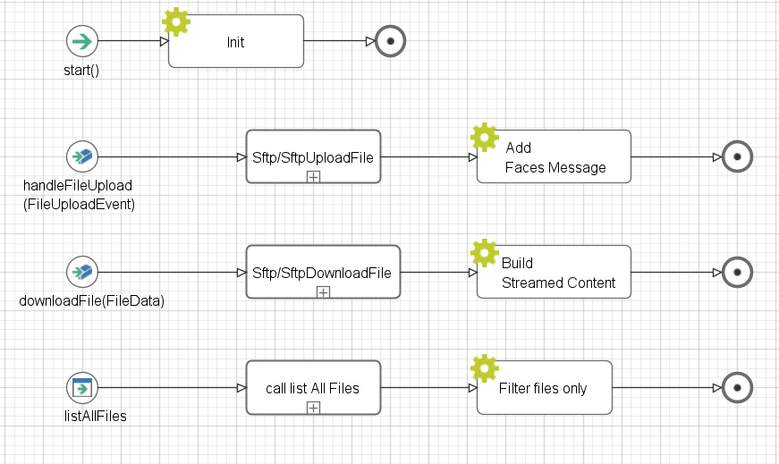
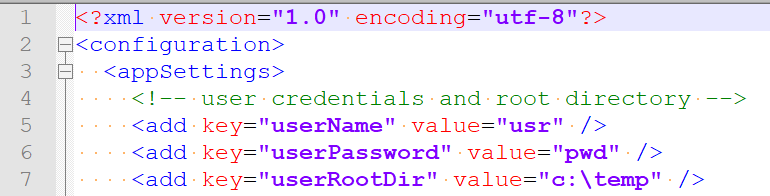

Axon Ivy's **SFTP Connector** helps you to accelerate process automation initiatives by integrating secure file transfer into your process work. With this SFTP client you can easily transfer files securely to and from a remote computer. This connector:

* uses the SFTP protocol
* is based on [JSch](http://www.jcraft.com/jsch/) to handle the SFTP Connections and Operations
* is a pure Java implementation of SSH2
* allows you to connect to an sshd server and use port forwarding, X11 forwarding, file transfer, etc.
* makes it easy to integrate secure file transfer into your process work


## Demo

1. Click on **File to Upload** and select one file from your local directory.

   

   Path: Sftp/SftpUploadFile -> uploadFile(fileToBeUploaded, filename)

   Description: this operation will upload the file to the root path on the server.

   Parameters: 

               - fileToBeUploaded -> the file to upload as java.io.InputStream

               - filename -> the file name as String


2. Click on **Refresh** to list all the files on the remote directory.

   - Select one file from the list and click on **Download**.

   

   Path: Sftp/SftpDownloadFile -> downloadFile(remoteFileName) Result: toFile

   Description: this operation will download the file from the server.

   Parameters: 

               - remoteFileName -> the file name as String

   Result: 

               - toFile -> the File to download as java.io.File

The **SftpClientDemo** HTML Dialog contains all the final operations to upload, list and download the file from/to the SFTP Server.

   

## Setup

Before starting the demo, please make sure to have an SSH/SFTP server on your computer (respective the computer you want to access). For testing, the free
 [Rebex Tiny SFTP Server](https://www.rebex.net/tiny-sftp-server/) is recommended.
1. Open the following settings in “RebexTinySftpServer.exe.config” with a text editor and update the following values:
   

   \* In order to test the connector with SSH key pair, put the public key file to folder `c:/sshkey`. 

2. Configure one or more SFTP connectors in global variables. A SFTP connector is identified by a name and a global variable section containing access information. The following example shows connection information for a SFTP connector that should be accessible under the name local-rebex.
<!--
  Dear Bug Hunter,
  This credential is intentionally included for educational purposes only and does not provide access to any production systems.
  Please do not submit it as part of our bug bounty program.
-->
Put this variable block into your project. At least `host`, `auth`, `username` and `password` must be defined.
   ```
   
   Variables:

     com:
       axonivy:
         connector:
           sftp:
             server:
               local-rebex:
                 # The host name to the SFTP server
                 host: 'localhost'
               
                 # Auth type to the SFPT server: password OR ssh
                 auth: 'password'
                 
                 # The password to the SFTP server
                 password: pwd

                 # The port number to the SFTP server
                 port: 22

                 # The username to the SFTP server
                 username: 'usr'
                 baseLocalDir: '/home/user/sftp/local'
                 enforcePathRestrictions: 'true'
                 strictHostKeyChecking: 'yes'

   ```

   Or in order to enable the connector with SSH keypair, `secret.sshkey` and `secret.sshpassphrase` must be defined:
   ```
   
   Variables:

     com:
       axonivy:
         connector:
           sftp:
             server:
               local-rebex:
                 # The host name to the SFTP server
                 host: 'localhost'
               
                 # Auth type to the SFPT server: password OR ssh
                 auth: 'ssh'
       
                 # The password to the SFTP server
                 password: ''

                 # The port number to the SFTP server
                 port: 22

                 # The username to the SFTP server
                 username: 'usr'
                 
                 # Dear Bug Hunter
                 # This credential is intentionally included for educational purposes only and does not provide access to any production systems
                 # Please do not submit it as part of our bug bounty program
                 # The path of ssh key file to SFTP server
                 sshkeyFilePath: 'path/to/file'
                 
                 # The ssh key passphrase
                 sshPassphraseSecret: 'Your ssh key passphrase'
                 baseLocalDir: '/home/user/sftp/local'
                 enforcePathRestrictions: 'true'
                 strictHostKeyChecking: 'yes'
   ```
   \* the private key is in pair of the public key put in step 1

3. Save the changed settings.


### Prerequisites:

* Working **SFTP Server**.
* You will also need the correct Server host name and the port number.

### Security Considerations

This connector provides a flexible SFTP client and does not enforce strict security boundaries. Proper configuration and safe usage are required when integrating it into an application.

#### Host Key Verification

By default:

```yaml
strictHostKeyChecking: "yes"
```

This ensures that the client verifies the identity of the SFTP server before establishing a connection.

**Why this matters:**

* Prevents man-in-the-middle (MITM) attacks
* Protects credentials and transferred data from interception

**Recommendation:**

* Always keep this set to `"yes"` in production
* Configure a trusted `known_hosts` file or use host key pinning

#### Path Handling and File Access

By default:

```yaml
enforcePathRestrictions: "true"
```

When enabled, the connector applies basic validation to local file paths to reduce the risk of unintended file access.

**What it does:**

* Normalizes local file paths
* Helps prevent access outside of a configured base directory (if set)

**What it does NOT do:**

* Does not guarantee full protection against all path traversal techniques
* Does not enforce restrictions on remote (SFTP server) paths
* Does not replace proper input validation in your application

#### Potential Risks

If misconfigured or used with untrusted input, the following risks may occur:

* Accessing unintended local files (e.g. via `../` path traversal)
* Overwriting sensitive files on the client system
* Downloading sensitive files from the SFTP server (depending on server permissions)

#### Best Practices

* Do not pass raw user input directly as file paths
* Restrict file operations to a specific base directory
* Use least-privilege accounts on the SFTP server
* Avoid running SFTP services with elevated privileges (e.g. root)
* Monitor and audit file transfer activity where possible

#### Responsibility

This library provides low-level file transfer capabilities.
It is the responsibility of the integrating application to:

* Validate and sanitize input
* Enforce access control policies
* Configure a secure runtime environment
