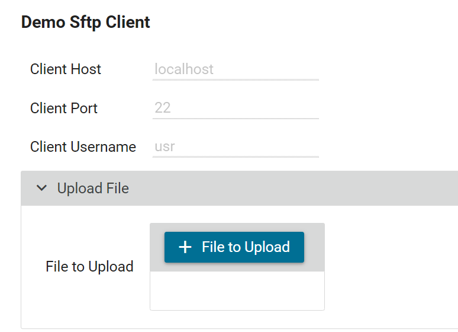
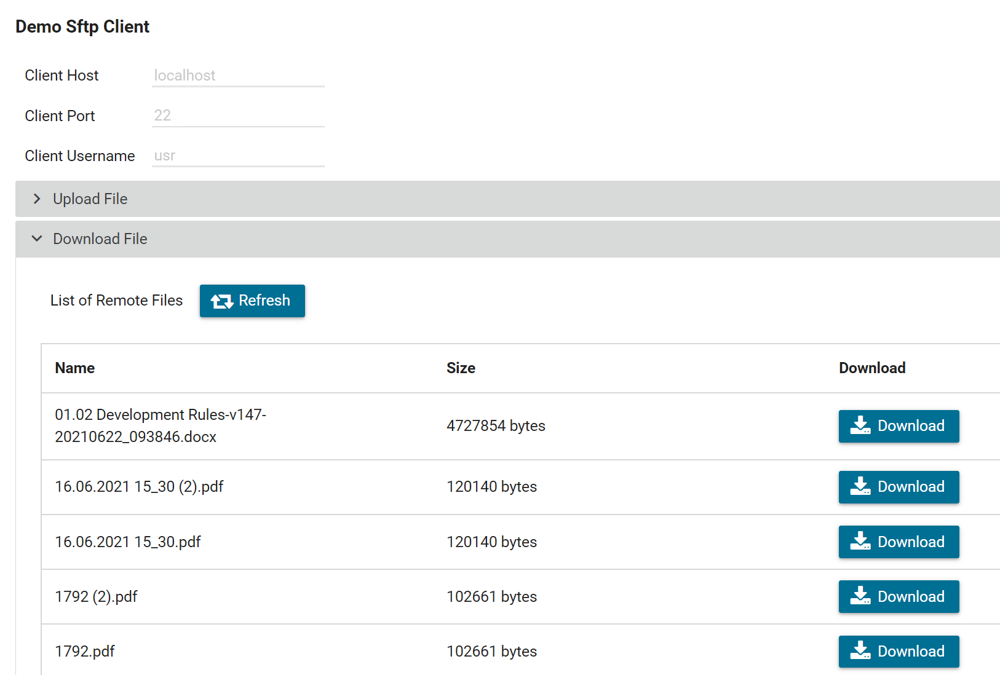
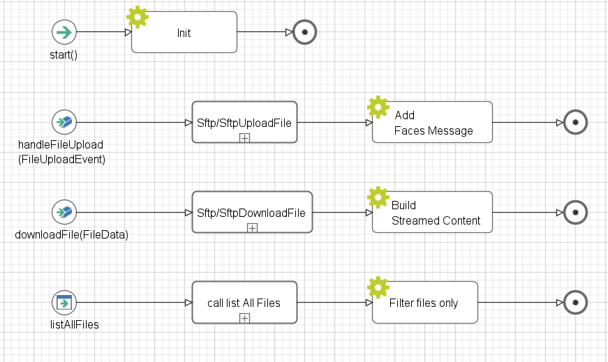
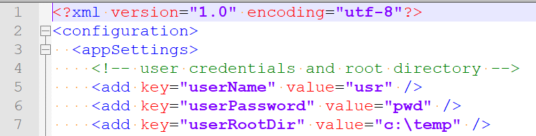

Axon Ivy's **SFTP Konnektor** unterstützt dich dabei, Prozessautomatisierung zu beschleunigen, indem er sicheren Dateitransfer in deine Arbeitsabläufe integriert. Mit diesem SFTP-Client kannst du einfach und sicher Dateien zu einem Remote-Computer übertragen und von dort empfangen. 

Dieser Konnektor:

- verwendet das SFTP-Protokoll
- basiert auf [JSch](http://www.jcraft.com/jsch/) zur Handhabung der SFTP-Verbindungen und -Operationen
- ist eine Java-Implementierung von SSH2
- ermöglicht es dir, eine Verbindung zu einem sshd-Server herzustellen und Port-Weiterleitung, X11-Weiterleitung, Dateitransfer usw. zu nutzen
- macht es einfach, sicheren Dateitransfer in deine Arbeitsabläufe zu integrieren


## Demo

1. Click on **File to Upload** and select one file from your local directory.

   

   Path: Sftp/SftpUploadFile -> uploadFile(fileToBeUploaded, filename)

   Description: this operation will upload the file to the root path on the server.

   Parameters: 

               - fileToBeUploaded -> the file to upload as java.io.InputStream

               - filename -> the file name as String


2. Click on **Refresh** to list all the files on the remote directory.

   - Select one file from the list and click on **Download**.

   

   Path: Sftp/SftpDownloadFile -> downloadFile(remoteFileName) Result: toFile

   Description: this operation will download the file from the server.

   Parameters: 

               - remoteFileName -> the file name as String

   Result: 

               - toFile -> the File to download as java.io.File

The **SftpClientDemo** HTML Dialog contains all the final operations to upload, list and download the file from/to the SFTP Server.

   

## Setup

Before starting the demo, please make sure to have an SSH/SFTP server on your computer (respective the computer you want to access). For testing, the free
 [Rebex Tiny SFTP Server](https://www.rebex.net/tiny-sftp-server/) is recommended.
1. Open the following settings in “RebexTinySftpServer.exe.config” with a text editor and update the following values:
   

2. Open the `configuration/variables.yaml` in your Designer and update the following global variables:

   ```
   
   Variables:

     com.axonivy.connector.sftp.server:
       # The host name to the SFTP server
       host: 'localhost'

       # The password to the SFTP server
       password: pwd

       # The port number to the SFTP server
       port: 22

       # The username to the SFTP server
       username: 'usr'

   ```

4. Save the changed settings.


### Prerequisites:

* Working **SFTP Server**.
* You will also need the correct Server host name and the port number.

