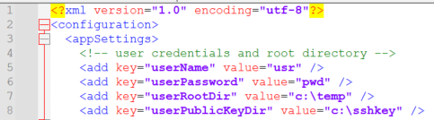

Der SFTP-Connector „ **” von Axon Ivy (** ) hilft Ihnen dabei, Initiativen zur
Prozessautomatisierung zu beschleunigen, indem er sichere Dateiübertragungen in
Ihre Arbeitsprozesse integriert. Mit diesem SFTP-Client können Sie Dateien ganz
einfach und sicher von und zu einem Remote-Computer übertragen. Dieser
Connector:

* verwendet das SFTP-Protokoll
* basiert auf [JSch](http://www.jcraft.com/jsch/) zur Verwaltung der
  SFTP-Verbindungen und -Vorgänge.
* ist eine reine Java-Implementierung von SSH2.
* Ermöglicht Ihnen die Verbindung zu einem sshd-Server und die Nutzung von
  Portweiterleitung, X11-Weiterleitung, Dateiübertragung usw.
* Erleichtert die Integration einer sicheren Dateiübertragung in Ihren
  Arbeitsprozess.

## Demo

1. Klicken Sie auf „ **-Datei hochladen” ( File to Upload)** und wählen Sie eine
   Datei aus Ihrem lokalen Verzeichnis aus.

   

   Pfad: Sftp/SftpUploadFile -> uploadFile(fileToBeUploaded, filename)

   Beschreibung: Bei diesem Vorgang wird die Datei in den Stammverzeichnispfad
   auf dem Server hochgeladen.

   Parameter:

               - fileToBeUploaded -> the file to upload as java.io.InputStream

               - filename -> the file name as String


2. Klicken Sie auf „ **“ (Dateien aus Remote-Verzeichnis abrufen). Aktualisieren
   Sie „** “, um alle Dateien im Remote-Verzeichnis aufzulisten.

   - Wählen Sie eine Datei aus der Liste aus und klicken Sie auf „ **“ (Datei
     herunterladen). Laden Sie „** “ herunter.

   

   Pfad: Sftp/SftpDownloadFile -> downloadFile(remoteFileName) Ergebnis: toFile

   Beschreibung: Bei diesem Vorgang wird die Datei vom Server heruntergeladen.

   Parameter:

               - remoteFileName -> the file name as String

   Ergebnis:

               - toFile -> the File to download as java.io.File

Die Datei „ **” „SftpClientDemo” „** ” „HTML Dialog” enthält alle abschließenden
Vorgänge zum Hochladen, Auflisten und Herunterladen der Datei vom/auf den
SFTP-Server.


## Einrichtung

Bevor Sie die Demo starten, stellen Sie bitte sicher, dass Sie einen
SSH/SFTP-Server auf Ihrem Computer (bzw. dem Computer, auf den Sie zugreifen
möchten) installiert haben. Zum Testen wird der kostenlose [Rebex Tiny SFTP
Server](https://www.rebex.net/tiny-sftp-server/) empfohlen.
1. Öffnen Sie die folgenden Einstellungen in „RebexTinySftpServer.exe.config”
   mit einem Texteditor und aktualisieren Sie die folgenden Werte:
   

   \* Um den Konnektor mit einem SSH-Schlüsselpaar zu testen, legen Sie die
   Datei mit dem öffentlichen Schlüssel im Ordner „ `” unter „c:/sshkey” ab.`.

2. Konfigurieren Sie einen oder mehrere SFTP-Konnektoren in globalen Variablen.
   Ein SFTP-Konnektor wird durch einen Namen und einen globalen
   Variablenabschnitt mit Zugriffsinformationen identifiziert. Das folgende
   Beispiel zeigt die Verbindungsinformationen für einen SFTP-Konnektor, der
   unter dem Namen local-rebex zugänglich sein sollte. Fügen Sie diesen
   Variablenblock in Ihr Projekt ein. Mindestens `host`, `auth`, `username` und
   `password` müssen definiert sein.
   ```

   Variables:

     com.axonivy.connector.sftp.server:
       local-rebex:
         # The host name to the SFTP server
         host: 'localhost'

         # Auth type to the SFPT server: password OR ssh
         auth: 'password'

         # The password to the SFTP server
         password: pwd

         # The port number to the SFTP server
         port: 22

         # The username to the SFTP server
         username: 'usr'

   ```

   Um den Connector mit SSH-Schlüsselpaar zu aktivieren, müssen `secret.sshkey`
   und `secret.sshpassphrase` definiert sein:
   ```

   Variables:

     com.axonivy.connector.sftp.server:
       local-rebex:
         # The host name to the SFTP server
         host: 'localhost'

         # Auth type to the SFPT server: password OR ssh
         auth: 'ssh'

         # The password to the SFTP server
         password: ''

         # The port number to the SFTP server
         port: 22

         # The username to the SFTP server
         username: 'usr'

         # The path of ssh key file to SFTP server
         sshkeyFilePath: 'path/to/file'

         # The ssh key passphrase
         sshPassphraseSecret: 'Your ssh key passphrase'
   ```
   \* Der private Schlüssel gehört zum öffentlichen Schlüssel, der in Schritt 1
   eingegeben wurde.

3. Speichern Sie die geänderten Einstellungen.

### Voraussetzungen:

* Arbeits- **SFTP-Server**.
* Außerdem benötigen Sie den korrekten Server-Hostnamen und die Portnummer.
